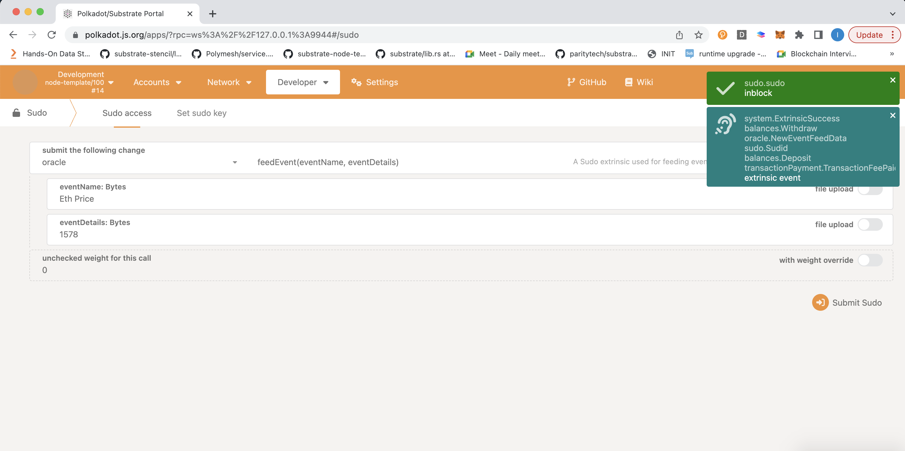

# Welcome to Ternoa Substrate Workshop!

**Workshop link:** [here](https://immanuel-john.github.io/ternoa-substrate-workshop/#/workshop/start).

This was created for the Ternoa Substrate Workshop.

In this workshop, you'll learn how to build a custom Substrate blockchain that can feed oracle event.

To follow along for this workshop, you'll either need:

- To have your local environment set up with Rust and a compiled version of the Node Template. Follow the [setup instructions](https://docs.substrate.io/tutorials/v3/create-your-first-substrate-chain/#install-required-packages).
- OR a GitHub account to use the [Substrate Playground](https://playground.substrate.dev/?deploy=node-template)

## What You'll Learn

* The basic patterns for building and running a Substrate node on your local machine.
* The basics of [Rust](https://www.rust-lang.org/) as used in Substrate.
* How to write a custom FRAME Pallet for an oracle event feed.
	* Create custom types.
	* Manage custom storage.
	* Write custom logic and callable functions.
* Integrate your new pallet into your Substrate runtime.

We have a lot to cover.
So let's get right to it!

<!-- slide:break -->

**Acknowledgements:** thank you to Shawn for the original tutorial, inspired by the [crypto zombies tutorial](https://cryptozombies.io/en/lesson/1/chapter/1).
