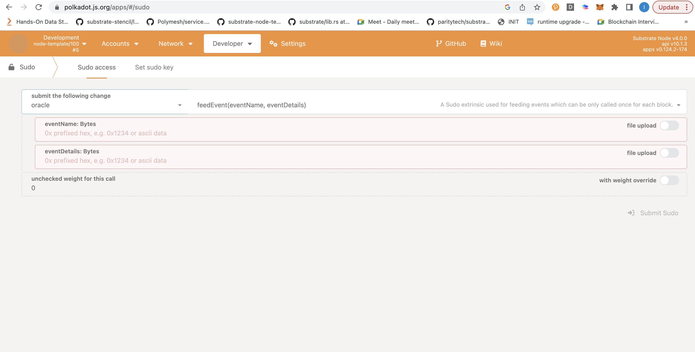

# Launch

Now its time to launch your chain and interact with it.

1. Build your chain:

```bash
cargo build --release
```

2. Launch it:

```bash
./target/release/node-template --dev
```

3. Open up [Polkadot JS Apps](https://polkadot.js.org/apps/?rpc=ws%3A%2F%2F127.0.0.1%3A9944#/explorer), connect to your local node under "Development".

4. Then head to "Developer -> Extrinsics" and submit a transaction using the `Oracle` pallet.



<!-- slide:break -->


Congratulations for completing this workshop with us! 🥳

Curious how you could write tests for your pallets? You can check the solution code of the kitties pallet [here](https://github.com/substrate-developer-hub/substrate-node-template/tree/tutorials/solutions/kitties/pallets/kitties) which includes tests that you can run using `cargo test -p pallet-kitties`.